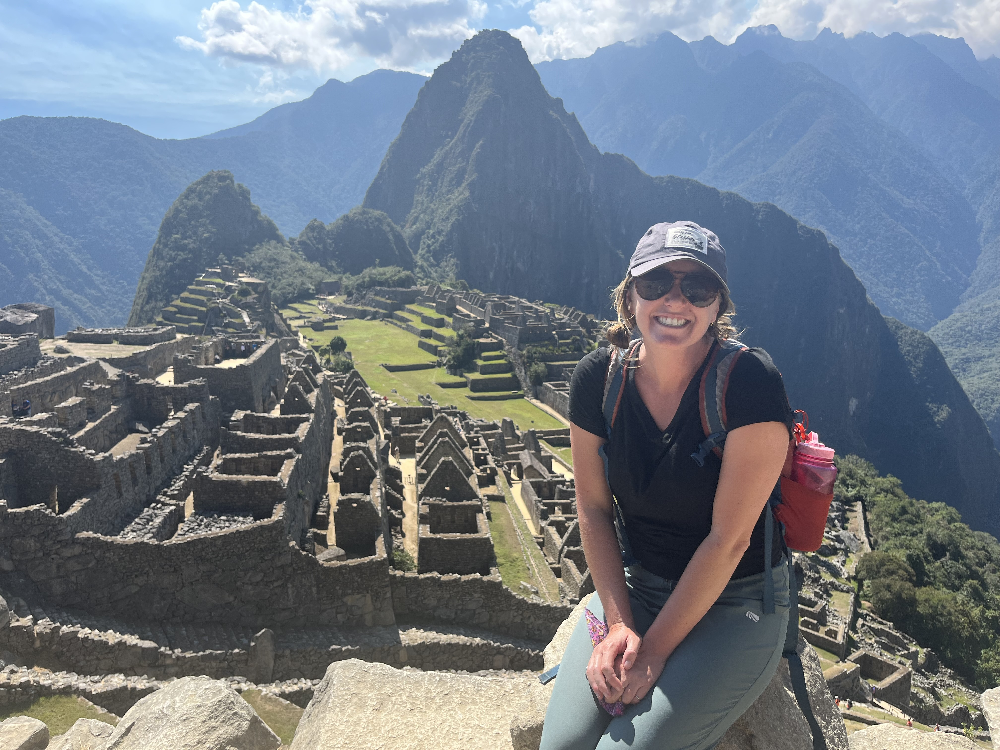

#K.Gilmore 
gilmorekn@appstate.edu 
:sunglasses: :sunflower: :earth_americas: :sunrise_over_mountains: :airplane:
__________
####Masters of Geography Student

####Appalachian State University 
#####[Department of Geography & Planning](https://geo.appstate.edu/)
______________
### Expertise 
*teaching, writing, facilitating* 
###Education 
####Appalachian State University
M.A. Geography & Planning, expected graduation *2024*
*GPA: 4.0*
Boone, NC

B.S. Middle Grades Education, *2013*
Concentrations: English Language, Social Studies
Minor: Spanish
*Magna Cum Laude*
Boone, NC

###Professional Experience 
****Graduate Assistant, *July 2023*****
 Peru Study Abroad 
 Appalachian State University
 Boone, NC

****Graduate Assistant, *2022-2024*****
Leadership & Outreach 
Community Engaged Leadership
Appalachain State University 
Boone, NC

 ****6th Grade Teacher, *2013-2022*/****
 English Langauge Arts & Social Studies
 Green Valley Elementary School
  Watauga County Schools
  Boone, NC
###Related Experience
- ESRI ArcGIS Pro 
- ESRI ArcGIS Map
- R Studio
- SaTScan 